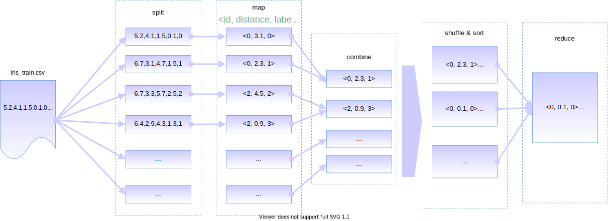

# 算法描述

这里我们介绍MapReduce-KNN算法的实现细节。算法的流程图如下图所示：



算法的输入是训练数据集和测试数据集，还有参数K，算法的输出为每个测试样本的标签预测值，以及本次预测的正确率。算法通过分布式文件缓存（Distributed File Cache）来向每台机器分发配置文件和测试数据集文件，而训练数据集则作为MapReduce的输入文件，由系统切分并传入Mapper进行后续处理。算法用Key来标志每一个测试样本，用一个浮点数和字符串的对子来表示某个训练样本和测试样本的距离，以及该训练样本的标签。这个数据结构可以形式化的定义为一个三元组：

$$
triple \equiv (id,dist,label), id\in \mathbb{N},dist\in\mathbb{R},label\text{ is a string}.
$$

算法主要由三个类实现，它们的功能列举如下：

- `KnnMapper`：把输入的一条训练样本和所有的测试样本计算距离，并输出距离和训练样本的标签。
- `KnnCombiner`：对于同一个测试样本，只保留至多K个距离标签对。
- `KnnReducer`：对于所有测试样本，分别只保留K个距离标签对，并分别选出出现频率最高的标签。

算法的伪码如下：

```python
class Mapper:
    def map(self, training_record, context):
        # compute dist(train, test) between input training record and each testing record.
        for tid, t in enumerate(testing_records):
            dist = compute_distance(training_record, t)
            label = training_record.label
            context.write(tid, (dist, label))

class Combiner:
    def combine(self, tid, K, dist_label_list, context):
        # filter the output of map() by passing through no more than K pairs.
        sort(dist_label_list, key='dist') # sort the list by distance.
        if len(dist_label_list) > K:
        	dist_label_list = dist_label_list[:K] # Keep the first K pairs.
        for dist, label in dist_label_list: # output.
            context.write(tid, (dist, label))
        
class Reducer:
    def reduce(self, tid, K, dist_label_list, context):
        self.knn = {} # handle each tid with a list.
        if not tid in knn:
            self.knn[tid] = [] # this list keeps k-nearest-neigbours of tid.
        self.knn[tid].extend(dist_label_list)
        
    def cleanup(self, K, context):
        for tid, neigbours in self.knn.items():
            if len(neigbours) > K:
                self.knn[tid] = neigbours[:K] # keep at most K item.
                
        # make prediction for all testing examples.        
        for tid, neigbours in self.knn.items():
            result = self.predict(neigbours)
            context.write(tid, result)
            
    def predict(self, neigbours): # neigbours is a list of (dist, label).
        # Make prediction based on majority vote.
        from collections import Counter
        # put all the labels into a Counter.
        counter = Counter([pair[1] for pair in neigbours])
        return counter.most_common()
```
