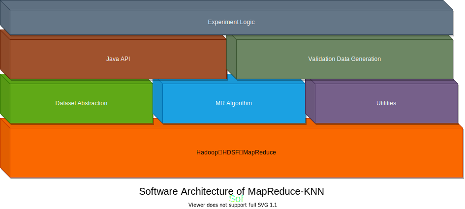

# Algorithm & software architecture


## Algorithm

Here we introduce the implementation details of the MapReduce KNN algorithm. The flow chart of the algorithm is shown below:


The input of the algorithm is the training data set and the test data set, as well as the parameter K. The output of the algorithm is the tag prediction value of each test sample and the accuracy of this prediction. The algorithm distributes configuration files and test dataset files to each machine through the Distributed File Cache, while the training dataset is used as the input file of MapReduce, which is split by the system and transferred to Mapper for subsequent processing. The algorithm uses a Key to mark each test sample, and a pair of floating point numbers and strings to represent the distance between a training sample and a test sample, as well as the label of the training sample. This data structure can be formally defined as a triple:

$$
triple\equiv (id,dist,label) \\
\text{where } id\in \mathbb{N},dist\in\mathbb{R},label\text{ is a string.}
$$
The whole algorithm revolves around processing such triples.

The algorithm is mainly implemented by three classes, and their functions are listed as follows:

- `KnnMapper` calculates the distance between one input training sample and all test samples and outputs the distance and the label of training samples.
- `KnnCombiner` only retains up to K distance label pairs for the same test sample.
- `KnnReducer`  only retains K distance label pairs for all test samples, and the label with the highest frequency is selected 


The pseudocode of the algorithm is as follows:

```python
class Mapper:
    def map(self, training_record, context):
        # compute dist(train, test) between input training record and each testing record.
        for tid, t in enumerate(testing_records):
            dist = compute_distance(training_record, t)
            label = training_record.label
            context.write(tid, (dist, label))

class Combiner:
    def combine(self, tid, K, dist_label_list, context):
        # filter the output of map() by passing through no more than K pairs.
        sort(dist_label_list, key='dist') # sort the list by distance.
        if len(dist_label_list) > K:
        	dist_label_list = dist_label_list[:K] # Keep the first K pairs.
        for dist, label in dist_label_list: # output.
            context.write(tid, (dist, label))
        
class Reducer:
    def reduce(self, tid, K, dist_label_list, context):
        self.knn = {} # handle each tid with a list.
        if not tid in knn:
            self.knn[tid] = [] # this list keeps k-nearest-neigbours of tid.
        self.knn[tid].extend(dist_label_list)
        
    def cleanup(self, K, context):
        for tid, neigbours in self.knn.items():
            if len(neigbours) > K:
                self.knn[tid] = neigbours[:K] # keep at most K item.
                
        # make prediction for all testing examples.        
        for tid, neigbours in self.knn.items():
            result = self.predict(neigbours)
            context.write(tid, result)
            
    def predict(self, neigbours): # neigbours is a list of (dist, label).
        # Make prediction based on majority vote.
        from collections import Counter
        # put all the labels into a Counter.
        counter = Counter([pair[1] for pair in neigbours])
        return counter.most_common()
```


## Software architecture

The software architecture of this project is shown in the following figure:



Since this project is a distributed KNN algorithm based on the Hadoop MapReduce framework, the bottom software is the Hadoop framework. On the Hadoop framework, they are

- Dataset Abstraction: enables our software to process different datasets such as Iris datasets.
- MR algorithm: the core implementation of the KNN algorithm based on MapReduce.
- Utilities: Common code such as file system operations, log models, data processing, and configuration files.

This layer is called the core algorithm layer, which is the basis of all experiments. However, because the input and output of MapReduce are based on files, it is not convenient to call it in Java. To make the top-level experimental logic use more convenient interfaces, we added a Java API layer on the core algorithm layer to encapsulate the input and output of the core algorithm and configuration files and provide Java object-based interfaces. At the same time, because cross-validation needs to partition training data, and there are also methods such as Boostrap to verify algorithm performance, we provide a Validation Data Generation module to serve the above experimental layer.

The top layer is the experimental layer, which provides the following experiments:
Cross-validation experiment: cross-validation can be performed on the training set of a dataset (`KnnExperiment`)
- KNN prediction: it can predict an input test set and count the accuracy (`KnnPredictor`)
- K value tuning experiment: it can measure the performance of different K value algorithms on a data set, to find the optimal K value (`KnnFineTune`)

Through this layered software architecture, our project successfully realized the necessary functions and obtained the experimental results. At the same time, the layered structure makes the code structure clear and easy to maintain.
