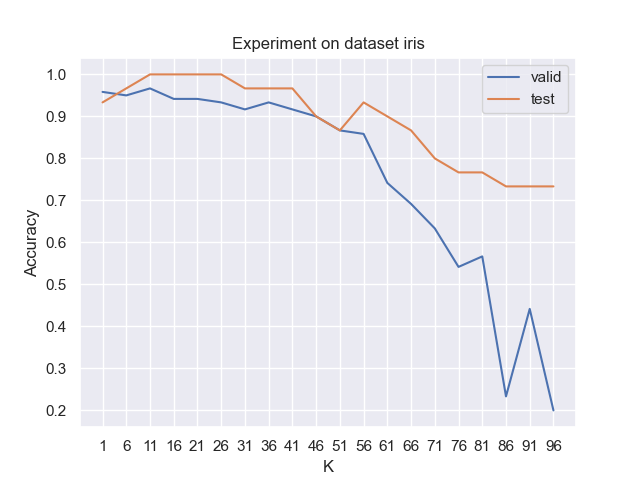
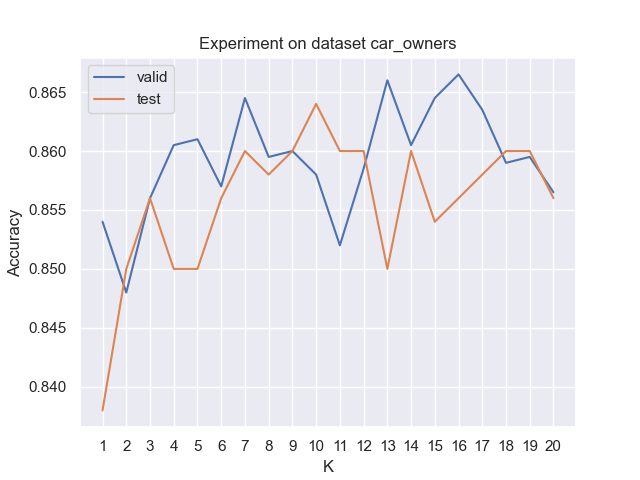

# Experimental result

## Experiment purpose

As a classification algorithm, KNN has two main parameters. The first is the value of K, which determines the range of the algorithm to search for a feasible solution near the test sample, and has a key impact on the performance; The other is a function to measure the distance between two samples. The most common ones are European distance and Manhattan distance. The main purpose of this experiment is to observe the rule that the performance of the algorithm changes with the change of the K value on the premise that the distance function is unchanged. From the perspective of parameter tuning, this experiment can also be interpreted as finding the K value that makes the algorithm perform optimally. Therefore, this experiment can also be called a "K value tuning experiment".


## Experimental configuration

### Datasets used

Two datasets were used in this experiment, namely, the Iris dataset and CarOwners dataset. In the Iris dataset, we predict flower types (iris of 4 varieties) according to three features of the sample, such as calyx length. In the CarOwners dataset, we predict the car model based on the age, gender, income, and other characteristics of the car owner. In terms of sample size, the Iris dataset has about 100 samples, while the CarOwners dataset has 2500 samples.


### Experimental methods

For each data set, we first divide all data into a test set and a training set. Taking the Iris data set as an example, the following two files are generated:

```
data\iris\iris_test.csv
data\iris\iris_training.csv
```

Then, for each K value, we use the 5-fold cross-validation method to divide the training data into five parts. Each time, one part of the training data is used as the test data, and the remaining four parts are used as the training data to test the performance of the algorithm respectively. The average value of the five times is used as the performance estimate of the algorithm on the whole training set. This can effectively reduce the random error generated by a single run. Five folds are used because they are commonly used values.

After using cross-validation to obtain the performance of the algorithm on the training set, we selected the best K value based on the performance on the training set. To verify the effectiveness of the optimal K value we selected, we further observed the impact of different K values on the test set and found that the K value selected based on the training set also has a near-optimal performance on the test set, which shows the effectiveness of the parameter adjustment method based on the training set.

For different sample numbers of the two data sets, we set different K value search ranges. Generally speaking, with the increase of the data set, the neighborhood of the test sample can also be appropriately expanded, but it does not need to be expanded to the same size as the number of training samples, because then the distance function will not work. Based on this consideration, we set a smaller search range and step size for smaller Iris datasets, and a larger search range and step size for larger CarOwners datasets.

In addition, the above search range for K is a rough search, which can only point out the interval of the optimal K value and cannot determine the specific K value. For this reason, we reduce the step size in the interval determined by the above rough search to determine the accurate K value. Finally, the performance evaluation index we use is the classification accuracy, that is, the ratio of the number of samples correctly classified by the algorithm to the total number of samples. The formula for classification accuracy is as follows:

$$
ACC=\frac{1}{n}\sum_{i=1}^n I(y_i=\hat{y_i})
$$


We will show the search results of the K value in detail in Experimental Results and Analysis.

### Software and hardware environment

This experiment is based on Ubuntu 20.04 operating system, VMWare Pro 15.05 virtual machine platform, Hadoop 3.1.3, JDK-8, and Windows 10 host operating system.


## Experimental Results and Analysis

#### Iris dataset

On the Iris dataset, the curve of algorithm performance versus the K value is shown in the following figure. The blue curve represents the cross-validation performance of the algorithm on the training set, and the red curve represents the performance data of the algorithm with the training set as the training sample and the test set as the test sample.

To exclude the above two cases, the number of training samples and the number of test samples are different, resulting in no comparability between the two curves, we make the ratio of the number of training samples and the number of test samples in the two cases remain unchanged, 1.25, as shown in the following table:

|                  | #training samples | #testing samples |
| ---------------- | ---------- | ---------- |
| Cross-validation | 96       | 24        |
| Test set experiment   | 120       | 30        |


We first search for the K value in the interval of $[1,100]$ and find that with the increase of K, the verification performance and test performance of the algorithm are declining. The K value with the best algorithm performance is concentrated in the interval $[11,26]$, reaching 100% classification accuracy.



Next, we conduct a small search on K, and the results are shown in the following figure. We find that when the K step size is small, the performance of cross-validation is not completely positively related to the performance of the test set. We found that in the test set when K is 8, 9, 11 to 20, the performance is the best, while in the training set when K is 3, 6, 7, 9, the performance is the best. Therefore, although the change trends of the two are different, the K value with the best performance overlaps when K=9, indicating that the parameter adjustment results on the training set still have a certain reference role for the test set.

In the two experiments with large and small K ranges, we observed that the trend of the red curve and the blue curve had a large difference, which can be attributed to the small number of samples in the data set, resulting in a large variance. Experiments on the CarOwners dataset show that the trend of the red curve and the blue curve becomes closer as the number of samples in the dataset increases. When the number of samples is large enough, an accurate optimal K value can be obtained based on cross-validation on the training set.


#### CarOwners dataset

For the CarOwners dataset, we also conducted a similar experiment. The number of training and test samples for the cross-validation performance experiment and test set performance experiment is shown in the following table:

|                  | #training samples | #testing samples |
| ---------------- | ---------- | ---------- |
| Cross-validation | 1600       | 400        |
| Test set experiment   | 2000       | 500        |

The results of a rough search on a large range of $[1, 1500]$ are shown in the figure below. It can be seen that with the increase of K, the two performances show a sharp downward trend, but when K is large, the performance has some fluctuations. According to our conjecture, when K is large enough, it is unlikely that the performance will rise again, because when K is large, many training samples with low similarity to the test samples will interfere with the algorithm's decision, thus reducing the performance. In addition, the two curves reach a maximum at a very close place, about the position where K resides in $[10,20]$.

To further determine the optimal K value, we reduced the step size within the above optimal range for experiments, and the results are shown in the following figure:



It can be seen that the two curves are not synchronized at many extreme points. For example, the blue curve has a maximum at K=13, while the red curve has a minimum at K=13. However, the overall trend of the two curves is to rise first and then decline, which indicates that the curve graph shows the situation near the maximum of the above large-scale curve graph. Regarding the optimal value of K, we find that the blue curve gets the maximum value at K=16, while the red curve gets the maximum value at K=10, which is relatively close. This shows that the estimation of the optimal value of K obtained from the training data is very close to the optimal value of K on the test set, which shows that our parameter adjustment strategy is effective.


## Conclusions

This experiment uses cross-validation to find the optimal K value on two datasets with scale differences and verifies the validity of the K value obtained by cross-validation on the corresponding test set. This experiment has the following conclusions:

1. For the KNN algorithm, on the same data set, with the increase of K value, the performance of the algorithm first increases and then decreases, showing a unimodal curve.
2. For the same algorithm, cross-validation is used to optimize the parameters on the training set, and the optimal parameters obtained are relatively close to the optimal parameters on the test set.
3. The larger the number of samples in the data set, the closer the performance curve of cross-validation is to the performance curve of the test set so that the optimal parameter values obtained by cross-validation based on the training set are closer to the true optimal parameter values on the test set.


## Future improvements

This experiment has the following shortcomings, which can be improved as follows:

1. The experiment did not consider the impact of different distance functions on the algorithm performance. The distance function can be used as the object of parameter adjustment to observe the impact of different data sets on the optimal distance function.
2. This experiment uses a single performance indicator, and we can consider verifying the conclusion of the experiment from multiple indicators.
3. The data set used in this experiment is small, and larger data sets can be used.

