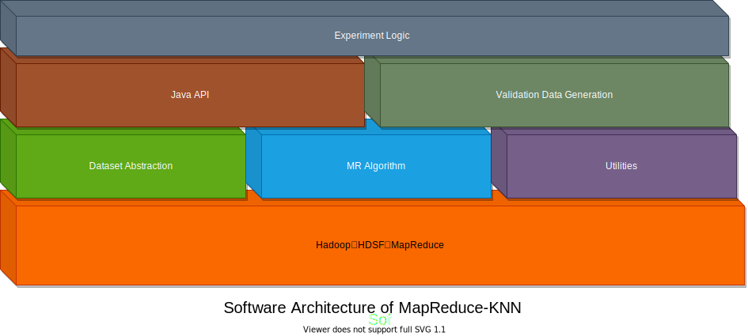

# Software architecture

The software architecture of this project is shown in the following figure:

## 1. Algorithm layer

Since this project is a distributed KNN algorithm based on the Hadoop MapReduce framework, the bottom software is the Hadoop framework. On the Hadoop framework, they are

- Dataset Abstraction: enables our software to process different datasets such as Iris datasets.
- MR algorithm: the implementation of the KNN algorithm based on MapReduce.
- Utilities: Common code such as file system operations, log models, data processing, and configuration files.

This layer is called the algorithm layer, which is the basis of all experiments. 

## 2. Java API layer

However, because the input and output of MapReduce are based on files, it is not convenient to call it in Java. To make the top-level experimental logic use more convenient interfaces, we added a Java API layer on the algorithm layer to encapsulate the input and output of the algorithm and configuration files and provide Java object-based interfaces. At the same time, because cross-validation needs to partition training data, and there are also methods such as Boostrap to verify algorithm performance, we provide a Validation Data Generation module to serve the above experiment layer.

## 3. Experiment layer

The top layer is the experiment layer, which provides the following experiments:
Cross-validation experiment: cross-validation can be performed on the training set of a dataset (`KnnExperiment`)
- KNN prediction: it can predict an input test set and count the accuracy (`KnnPredictor`)
- K value tuning experiment: it can measure the performance of different K value algorithms on a data set, to find the optimal K value (`KnnFineTune`)

Through this layered software architecture, our project successfully realized the necessary functions and obtained the experimental results. At the same time, the layered structure makes the code structure clear and easy to maintain.
