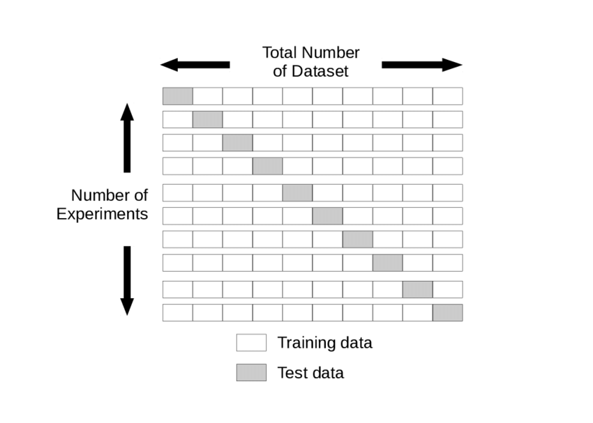
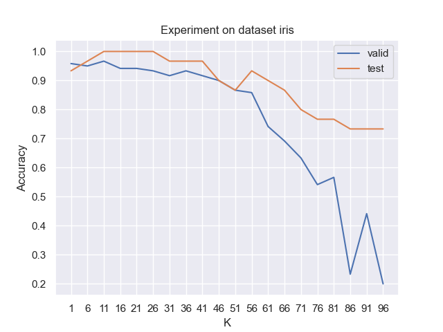
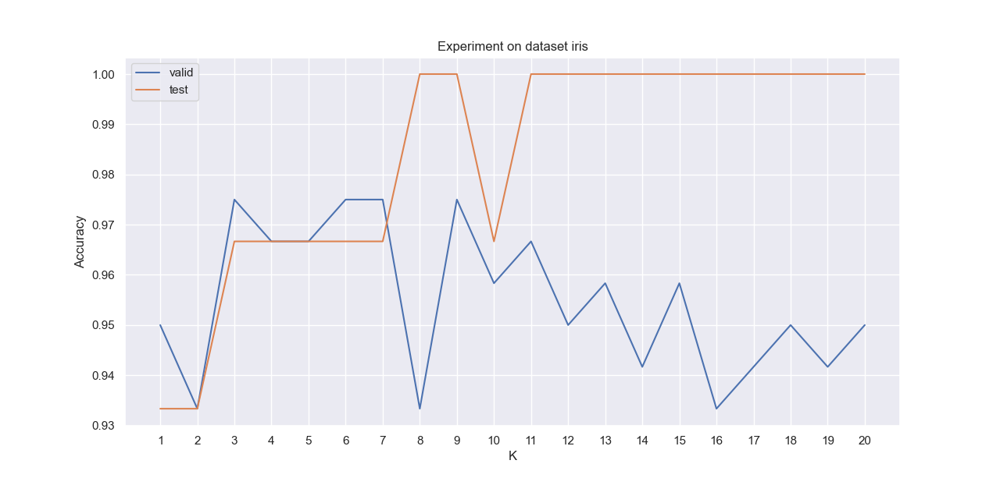
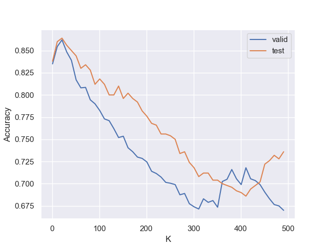
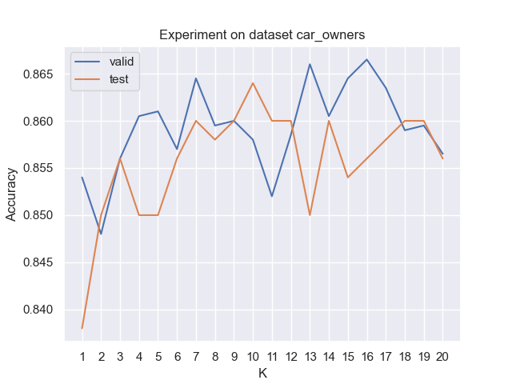

# 实验结果

## 实验目的

KNN 作为一个分类算法，它主要的参数有两个，第一是K的取值，它决定了算法在测试样本附近多大的范围内搜索可行解，对性能具有关键影响；另一个是衡量两个样本之间的距离的函数，最常见的有欧式距离和曼哈顿距离等。本实验的主要目的是在距离函数不变的前提下，观察算法的性能随着K值的变化而变化的规律。从参数调优的角度理解，本实验也可以解释为寻找使算法性能最优的K值，因此本实验也可称为“K值的调优实验”。


## 实验配置

### 使用的数据集

本实验使用了两个数据集，分别是Iris数据集（鸢尾花数据集）和CarOwners数据集。在Iris数据集中，我们根据样本的花萼长度等三个特征来预测花的种类（4个品种的鸢尾花）。在CarOwners数据集中，我们根据车主的年龄、性别和收入等特征来预测车的型号。就样本数量来说，Iris数据集的样本大约100多个，CarOwners数据集则有2500个样本。

### 实验方法

对于每个数据集，我们先把全部数据分为测试集和训练集，以Iris数据集为例子，产生以下两个文件：

```
data\iris\iris_test.csv
data\iris\iris_training.csv
```

然后，对于每个K值，我们采用5-fold交叉验证的方法，把训练数据均分为5部分，每次以其中一部分为测试数据，剩下的4部分为训练数据，分别测试算法的性能，把5次性能的平均值作为算法在整个训练集上的性能估计值，这样做能够有效的降低单次运行产生的随机误差。使用5个fold是因为这是比较常用的数值。



在使用交叉验证得出算法在训练集上的性能后，我们基于训练集上的性能选定了表现最好的K值。为了验证我们选取的最优的K值的有效性，我们进一步在测试集上观察不同K值的影响，发现基于训练集选定的K值，对测试集也具有接近最优的表现，从而说明了基于训练集的调参方法的有效性。

针对两个数据集不同的样本数量，我们设置了不同的K值搜索范围。一般来说，随着数据集的增大，则测试样本的邻域也可以适度扩大，但是不需要扩大到和训练样本数量一样大，因为那样的话，距离函数就不起作用了。基于这个考虑，我们对较小的Iris数据集设置较小的搜索范围和步长，而对较大的CarOwners数据集设置了较大的搜索范围和步长。

另外，上述的对K的搜索范围是一个模糊的搜索，它只能指出最优的K值所在的区间，不能确定具体的K值。为此，我们在上述粗略搜索确定的区间内缩小步长以确定精确的K值。最后，我们使用的性能评价指标是分类正确率，即算法正确分类的样本数占总样本数的比值。分类正确率的公式如下所示：
$$
ACC=\frac{1}{n}\sum_{i=1}^n I(y_i=\hat{y_i})
$$


我们将在 [实验结果及分析](###实验结果及分析) 中详细展示K值的搜索结果。

### 软硬件环境

本实验基于 Ubuntu 20.04 操作系统，VMWare Pro 15.05 虚拟机平台，Hadoop 3.1.3，JDK-8，Windows 10宿主机操作系统 进行。


## 实验结果及分析

#### Iris数据集

在Iris数据集上，算法性能随K值变化的曲线如下图所示。其中，蓝色曲线表示算法在训练集上进行交叉验证的性能，红色曲线表示算法以训练集为训练样本，以测试集为测试样本的性能数据。

为了排除上述两种情况下，训练样本数和测试样本数不同而造成两个曲线没有可比性，我们令两种情况下的实验的训练样本数和测试样本数的比值保持不变，为1.25，如下表所示：

|                  | 训练样本数 | 测试样本数 |
| ---------------- | ---------- | ---------- |
| 交叉验证性能实验 | 96         | 24         |
| 测试集性能实验   | 120        | 30         |


我们首先在 $[1, 100]$ 的区间内搜索 K 值，发现随着K的增大，算法的验证性能和测试性能都不断下降。使算法性能最好的K值集中在区间 $[11, 26]$，达到了100%的分类正确率。



接下来，我们对K进行小范围的搜索，结果如下图所示。我们发现在K的步长取得较小时，交叉验证的性能和测试集性能不是完全正相关的。我们发现在测试集上，K取8，9，11至20时，性能最好，而在训练集上，K取3，6，7，9时性能最好。因此，尽管二者的变化趋势有差异，但是性能最好的K值在K=9时重合，说明训练集上的调参结果对测试集仍有一定参考作用。

在K范围较大和较小的两个实验中，我们都观察到红色曲线和蓝色曲线的变化趋势具有较大差异，这个可以归因于数据集的样本数量较小，造成方差较大所造成的。在CarOwners 数据集上进行的实验表明，随着数据集的样本数增大，红色曲线和蓝色曲线的变化趋势变得更接近了。当样本数量足够大时，基于训练集上的交叉验证就能获得比较准确的最优K值。



#### CarOwners 数据集

对于CarOwners 数据集，我们也做了类似的实验。其中，交叉验证性能实验和测试集性能实验的训练和测试样本数量如下表所示：

|                  | 训练样本数 | 测试样本数 |
| ---------------- | ---------- | ---------- |
| 交叉验证性能实验 | 1600       | 400        |
| 测试集性能实验   | 2000       | 500        |

可以看到，训练样本和测试样本的比例保持为4不变。

在K的一个大区间$[1,500]$上进行粗略搜索的结果如下图所示，可以看到，随着K的增大，两个性能呈现急剧下降趋势，但在K较大时，性能有一定的起伏。根据我们的推测，当K足够大时，性能重新上升的可能性不大，因为当K很大时，许多与测试样本相似度很低的训练样本会干扰算法的决策，从而使性能下降。此外，两条曲线在一个相当接近的地方达到一个极大值，大约是K取$[10,20]$的位置。



为了进一步确定最优的K值，我们在上述最优范围内缩小步长进行实验，结果如下图所示：



可以看到，两条曲线在许多极值点处并不同步，比如蓝色曲线在K=13处有一个极大值，而红色曲线在K=13处却取极小值。但是，两条曲线的总体趋势都是先上升后下降，这说明这个曲线图显示的，实际上就是上面的大范围曲线图的极大值附近的情况。关于K的最优值，我们发现蓝色曲线在K=16处取得最大值，而红色曲线在K=10处取得最大值，二者相对来说是非常接近的。这说明了从训练数据得出的K的最优值的估计是非常接近在测试集上的最优K值的，从而说明我们的调参策略是有效的。


## 实验结论

本实验在两个规模差异较大的数据集上，利用交叉验证寻找最优K值，并在相应的测试集上验证了交叉验证得出的K值的有效性。本实验有以下结论：

1. 对KNN算法而言，在同一数据集上，随着K值的增大，算法的性能先上升后下降，呈现单峰曲线。
2. 对于同一个算法而言，在训练集上利用交叉验证进行参数调优，获得的最优参数与在测试集上的最优参数是相对接近的。
3. 数据集的样本数越大，交叉验证的性能曲线就越接近测试集的性能曲线，从而基于训练集的交叉验证所获得的最优参数值就越接近测试集上的真实的最优参数值。


## 不足与改进之处

本实验有以下不足之处，我们给出了改进的办法：

1. 实验没有考虑不同的距离函数对算法性能的影响，可以把距离函数作为调参的对象，观察不同数据集对最优距离函数的影响。
2. 本实验使用了单一的性能指标，可以考虑从多个指标去验证实验的结论。
3. 本实验所使用的数据集规模较小，可以使用更大规模的数据集。
