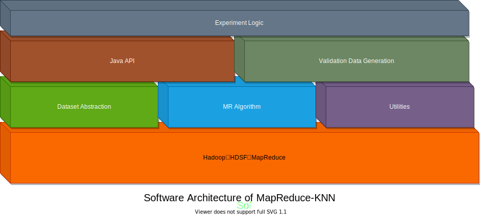

# 算法和软件架构

## 算法

这里我们介绍MapReduce-KNN算法的实现细节。

## 软件架构

本项目的软件架构如下图所示：

因为本项目是基于Hadoop MapReduce框架实现的分布式KNN算法，所以最底层的软件是Hadoop框架。在Hadoop框架之上，分别是：

- 数据集抽象（Dataset Abstraction）：使我们的软件能处理如Iris数据集等不同的数据集。
- MapReduce算法（MR Algorithm）：基于MapReduce的KNN算法的核心实现。
- 实用工具（Utilities）：诸如文件系统操作、日志模型、数据处理和配置文件等公共代码。

这一层称为**核心算法层**，它是所有实验的基础。但是，因为MapReduce的输入输出是基于文件的，在Java中调用不太方便，为了能使最顶层的实验逻辑使用更方便的接口，我们在核心算法层上加入了**Java API**层，对核心算法的输入输出以及配置文件进行封装，提供基于Java对象的接口。同时因为交叉验证需要对训练数据进行划分，并且还有诸如Boostrap等验证算法性能的方法，所以我们提供了一个**验证数据生成**的模块（Validation Data Generation），为上面的实验层服务。

位于最顶层的是**实验层**，它提供的实验有：

- 交叉验证实验：能在一个数据集的训练集上进行交叉验证（ `KnnExperiment`类）
- KNN预测：能对一个输入的测试集进行预测并统计正确率（`KnnPredictor`类）
- K值调优实验：能在一个数据集上对不同的K值测量算法的性能，从而找出最优的K值（`KnnFineTune`类）

通过这种分层的软件架构，我们的项目顺利实现了必须的功能，获得了实验结果。同时，分层的结构使得代码结构清晰明了，便于维护。
