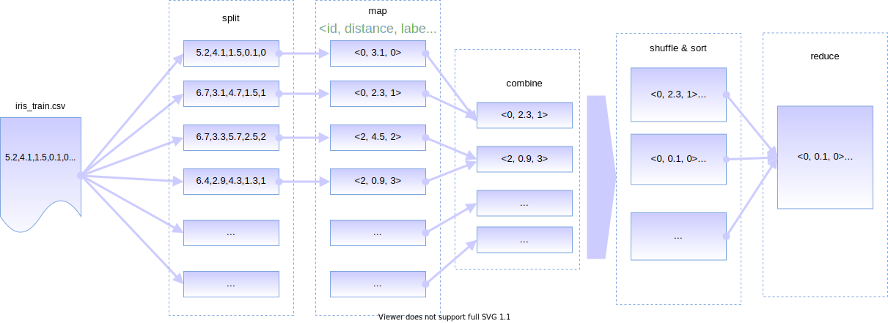

# 算法和软件架构


## 算法

这里我们介绍MapReduce-KNN算法的实现细节。算法的流程图如下图所示：



算法的输入是训练数据集和测试数据集，还有参数K，算法的输出为每个测试样本的标签预测值，以及本次预测的正确率。算法通过分布式文件缓存（Distributed File Cache）来向每台机器分发配置文件和测试数据集文件，而训练数据集则作为MapReduce的输入文件，由系统切分并传入Mapper进行后续处理。算法用Key来标志每一个测试样本，用一个浮点数和字符串的对子来表示某个训练样本和测试样本的距离，以及该训练样本的标签。这个数据结构可以形式化的定义为一个三元组：
$$
KNNTriple\equiv (id,dist,label) \\
id\in \mathbb{N},dist\in\mathbb{R},label\text{ is a string}
$$
整个算法都是围绕着处理这种三元组进行的。

算法主要由三个类实现，它们的功能列举如下：

- `KnnMapper`：把输入的一条训练样本和所有的测试样本计算距离，并输出距离和训练样本的标签。
- `KnnCombiner`：对于同一个测试样本，只保留至多K个距离标签对。
- `KnnReducer`：对于所有测试样本，分别只保留K个距离标签对，并分别选出出现频率最高的标签。

算法的伪码如下（用Python描述）：

```python
def map(training_record, context):
    # compute dist(train, test) between input training record and each testing record.
    for tid, t in enumerate(testing_records):
        dist = compute_distance(training_record, t)
        label = training_record.label
        context.write(tid, (dist, label))
        
def combine(tid, K, dist_label_list, context):
    # filter the output of map() by passing through no more than K pairs.
    sort(dist_label_list, key='dist') # sort the list by distance.
    if len(dist_label_list) > K:
    	dist_label_list = dist_label_list[:K] # Keep the first K pairs.
    for dist, label in dist_label_list: # output.
        context.write(tid, (dist, label))
        
# Reducer has many methods so make it a class.
class Reducer:
    def reduce(self, tid, K, dist_label_list, context):
        self.knn = {} # handle each tid with a list.
        if not tid in knn:
            self.knn[tid] = [] # this list keeps k-nearest-neigbours of tid.
        self.knn[tid].extend(dist_label_list)
        
    def cleanup(self, K, context):
        for tid, neigbours in self.knn.items():
            if len(neigbours) > K:
                self.knn[tid] = neigbours[:K] # keep at most K item.
                
        # make prediction for all testing examples.        
        for tid, neigbours in self.knn.items():
            result = self.predict(neigbours)
            context.write(tid, result)
            
   	def predict(self, neigbours): # neigbours is a list of (dist, label).
        # Make prediction based on majority vote.
        from collections import Counter
        # put all the labels into a Counter.
        counter = Counter([pair[1] for pair in neigbours])
        return counter.most_common()
        
```


## 软件架构

本项目的软件架构如下图所示：


因为本项目是基于Hadoop MapReduce框架实现的分布式KNN算法，所以最底层的软件是Hadoop框架。在Hadoop框架之上，分别是：

- 数据集抽象（Dataset Abstraction）：使我们的软件能处理如Iris数据集等不同的数据集。
- MapReduce算法（MR Algorithm）：基于MapReduce的KNN算法的核心实现。
- 实用工具（Utilities）：诸如文件系统操作、日志模型、数据处理和配置文件等公共代码。

这一层称为**核心算法层**，它是所有实验的基础。但是，因为MapReduce的输入输出是基于文件的，在Java中调用不太方便，为了能使最顶层的实验逻辑使用更方便的接口，我们在核心算法层上加入了**Java API**层，对核心算法的输入输出以及配置文件进行封装，提供基于Java对象的接口。同时因为交叉验证需要对训练数据进行划分，并且还有诸如Boostrap等验证算法性能的方法，所以我们提供了一个**验证数据生成**的模块（Validation Data Generation），为上面的实验层服务。

位于最顶层的是**实验层**，它提供的实验有：

- 交叉验证实验：能在一个数据集的训练集上进行交叉验证（ `KnnExperiment`类）
- KNN预测：能对一个输入的测试集进行预测并统计正确率（`KnnPredictor`类）
- K值调优实验：能在一个数据集上对不同的K值测量算法的性能，从而找出最优的K值（`KnnFineTune`类）

通过这种分层的软件架构，我们的项目顺利实现了必须的功能，获得了实验结果。同时，分层的结构使得代码结构清晰明了，便于维护。

